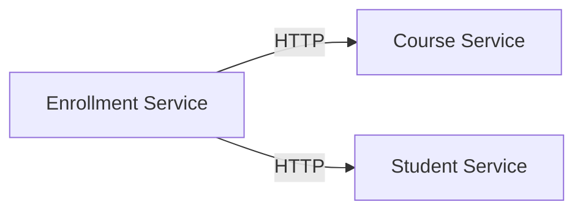

# LearningMicroservices

A beginner-friendly .NET 8 microservices solution to learn Docker and Docker Compose. This project contains three simple services: CourseService, StudentService, and EnrollmentService. All services store data in memory and communicate over HTTP using HttpClient. The solution demonstrates Docker multi-stage builds, Docker Compose networking, Swagger, logging, and health checks.

## Architecture

Mermaid diagram:



## Folder Structure

```
LearningMicroservices/
  src/
    CourseService/
    StudentService/
    EnrollmentService/
  docker-compose.yml
  README.md
  .gitignore
```

## How to build

Ensure you have Docker and Docker Compose installed.

To build images and run all services:

```bash
docker compose up --build
```

## Swagger URLs

- CourseService: http://localhost:5001/swagger
- StudentService: http://localhost:5002/swagger
- EnrollmentService: http://localhost:5003/swagger

## API Endpoints

See each service's Swagger page for details.

## Troubleshooting

- If ports are in use, stop other services or change ports in `docker-compose.yml`.
- If docker compose fails, try `docker compose down -v` and retry.

## Useful Docker Commands

- Build only: `docker compose build`
- Start in background: `docker compose up -d`
- Stop and remove: `docker compose down`
- View logs: `docker compose logs -f`
