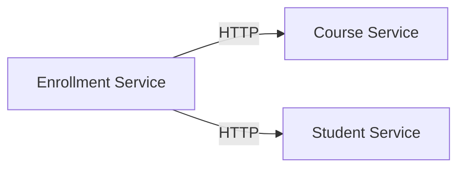

# LearningMicroservices

A beginner-friendly .NET 8 microservices solution to learn Docker, Docker Compose, and distributed systems. This project contains three ASP.NET Core services: **CourseService**, **StudentService**, and **EnrollmentService**. All services store data in memory, communicate over HTTP, and include Swagger documentation, structured logging, and health checks.

## 📋 Architecture



**Service Overview:**
- **CourseService** (Port 5001): Manages course catalog
- **StudentService** (Port 5002): Manages student information
- **EnrollmentService** (Port 5003): Manages enrollments and communicates with other services via HTTP

## 📁 Project Structure

```
LearningMicroservices/
├── src/
│   ├── CourseService/
│   │   ├── Controllers/
│   │   ├── Services/
│   │   ├── Data/
│   │   ├── Models/
│   │   ├── Interfaces/
│   │   ├── Properties/
│   │   ├── appsettings.json
│   │   ├── Program.cs
│   │   ├── CourseService.csproj
│   │   ├── Dockerfile
│   │   └── .dockerignore
│   ├── StudentService/
│   │   ├── Controllers/
│   │   ├── Services/
│   │   ├── Data/
│   │   ├── Models/
│   │   ├── Interfaces/
│   │   ├── Properties/
│   │   ├── appsettings.json
│   │   ├── Program.cs
│   │   ├── StudentService.csproj
│   │   ├── Dockerfile
│   │   └── .dockerignore
│   └── EnrollmentService/
│       ├── Controllers/
│       ├── Services/
│       ├── Data/
│       ├── Models/
│       ├── Interfaces/
│       ├── Properties/
│       ├── appsettings.json
│       ├── Program.cs
│       ├── EnrollmentService.csproj
│       ├── Dockerfile
│       └── .dockerignore
├── docker-compose.yml
├── .dockerignore
├── .gitignore
├── .gitattributes
├── README.md
└── .github/
    └── workflows/
        └── docker-ci-cd.yml
```

## 🚀 Quick Start

### Prerequisites
- Docker Desktop (with Docker Compose)
- .NET 8 SDK (for local development)

### Build and Run with Docker Compose

```bash
# Build and start all services
docker compose up --build

# Start services in detached mode (background)
docker compose up -d --build

# View logs
docker compose logs -f

# Stop all services
docker compose down

# Stop and remove volumes
docker compose down -v
```

The services will be available at:
- CourseService: `http://localhost:5001`
- StudentService: `http://localhost:5002`
- EnrollmentService: `http://localhost:5003`

### Local Development (without Docker)

```bash
# Restore dependencies for each service
cd src/CourseService
dotnet restore
dotnet build
dotnet run

# In another terminal
cd src/StudentService
dotnet restore
dotnet build
dotnet run

# In another terminal
cd src/EnrollmentService
dotnet restore
dotnet build
dotnet run
```

## 🔍 API Documentation (Swagger)

Access the interactive Swagger UI for each service:

- **CourseService Swagger**: http://localhost:5001/swagger/index.html
  - `GET /api/courses` - List all courses
  - `POST /api/courses` - Create a new course
  - `GET /api/courses/{id}` - Get course by ID
  - `DELETE /api/courses/{id}` - Delete a course

- **StudentService Swagger**: http://localhost:5002/swagger/index.html
  - `GET /api/students` - List all students
  - `POST /api/students` - Create a new student
  - `GET /api/students/{id}` - Get student by ID
  - `DELETE /api/students/{id}` - Delete a student

- **EnrollmentService Swagger**: http://localhost:5003/swagger/index.html
  - `GET /api/enrollments` - List all enrollments
  - `POST /api/enrollments` - Create a new enrollment
  - `GET /api/enrollments/{id}` - Get enrollment by ID
  - `DELETE /api/enrollments/{id}` - Delete an enrollment

## 🏥 Health Checks

Each service exposes a health check endpoint:
- `GET /health` - Returns `{ "status": "Healthy" }`

Example:
```bash
curl http://localhost:5001/health
```

## 📝 Key Features

- **Multi-Stage Docker Builds**: Optimized image sizes with separate build and runtime stages
- **Docker Compose Networking**: Services communicate using service names as hostnames
- **Swagger/OpenAPI**: Interactive API documentation for development
- **Structured Logging**: Console logging with structured information
- **In-Memory Data Storage**: Simple data persistence for learning purposes
- **Health Checks**: Built-in `/health` endpoints for service monitoring
- **.dockerignore**: Excludes unnecessary build artifacts from Docker context
- **Environment-Based Configuration**: Different settings for Development and Production

## 🔧 Configuration

### Environment Variables

Services support the following environment variables via `docker-compose.yml`:

```yaml
environment:
  - ASPNETCORE_ENVIRONMENT=Development
  - CourseServiceUrl=http://courseservice  # Used by EnrollmentService
  - StudentServiceUrl=http://studentservice  # Used by EnrollmentService
```

### Ports

| Service | Port | Container Port |
|---------|------|-----------------|
| CourseService | 5001 | 80 |
| StudentService | 5002 | 80 |
| EnrollmentService | 5003 | 80 |

## 🐛 Troubleshooting

### Port conflicts
If ports 5001, 5002, or 5003 are already in use:
```bash
# Option 1: Change ports in docker-compose.yml
# Option 2: Stop conflicting services
docker ps
docker stop <container-id>
```

### Build failures
```bash
# Clean up Docker resources
docker compose down -v
docker system prune -a

# Rebuild from scratch
docker compose up --build
```

### Service connection issues
- Ensure services are running: `docker compose ps`
- Check logs: `docker compose logs <service-name>`
- Verify network connectivity: `docker network ls`

### Swagger not loading
- Ensure `ASPNETCORE_ENVIRONMENT=Development` is set in docker-compose.yml
- Clear browser cache or use incognito mode
- Check service logs for errors

## 📚 Learning Resources

This project demonstrates:
- **.NET 8 ASP.NET Core** Web API fundamentals
- **Docker** containerization and multi-stage builds
- **Docker Compose** for local orchestration
- **Microservices** communication patterns (HTTP)
- **REST APIs** and OpenAPI/Swagger documentation
- **Structured Logging** and observability

## 📄 License

This project is open source and available for educational purposes.

## 🤝 Contributing

Feel free to fork this repository and submit pull requests for improvements!

## 📞 Support

For issues or questions, please open an GitHub issue in the repository.
